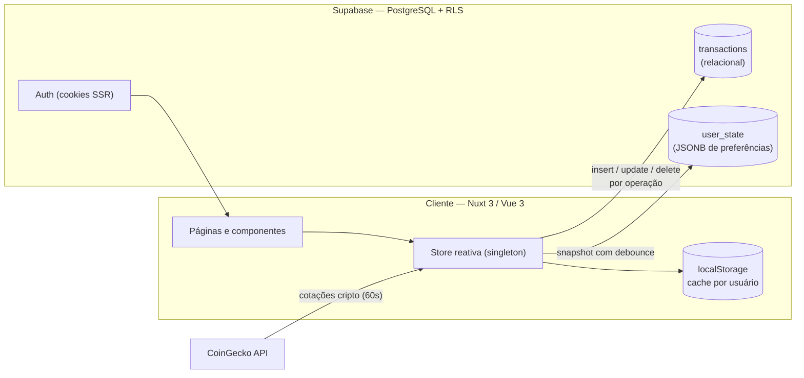

<div align="center">
  

  # FinanceFlow

  **Gestão financeira pessoal e compartilhada, bimoeda (BRL / USD), com cotações em tempo real.**

  [](https://nuxt.com)
  [](https://vuejs.org)
  [](https://www.typescriptlang.org)
  [](https://supabase.com)
  [](https://echarts.apache.org)
  [](https://vercel.com)

  [**Demo ao vivo**](https://finance-flow-murex.vercel.app) · [Reportar bug](../../issues) · [Sugerir feature](../../issues)
</div>

---

## Sobre o projeto

FinanceFlow é uma aplicação web full-stack para controle de finanças pessoais construída para um cenário real e pouco atendido pelas ferramentas tradicionais: **quem vive entre duas moedas**. Receitas em dólar, despesas em real, investimentos nos dois — tudo consolidado com câmbio aplicado em tempo real e alternância global de moeda de exibição (R$ ⇄ US$) em um clique.

Além do fluxo pessoal, o sistema suporta **contas conjuntas** (casal, república, viagem) com resumo por conta e divisão de saldo, e uma **carteira de investimentos** com atualização automática de cotações de criptoativos.

> O projeto está em produção e em uso diário — cada decisão de arquitetura abaixo nasceu de um problema real encontrado ao longo do desenvolvimento.

## Funcionalidades

| | |
|---|---|
| **Autenticação completa** | E-mail/senha com confirmação, recuperação e redefinição de senha, sessão SSR via cookies (`@nuxtjs/supabase`) |
| **Dashboard** | Visão geral do mês, receitas vs. despesas (6 meses), resumo por categoria, distribuição BRL × USD |
| **Lançamentos** | CRUD completo com filtros (tipo, moeda, busca), agrupamento por dia com subtotais, recorrência, contexto pessoal/conjunto |
| **Contas conjuntas** | Criação com membros, ícone e cor; resumo derivado dos lançamentos; divisão "quem deve a quem" |
| **Investimentos** | Carteira multi-corretora com **cotação automática de cripto (CoinGecko, refresh 60s)**, alocação por tipo, contas correntes |
| **Bimoeda real** | Cada lançamento guarda valor original + conversão; toggle global R$ ⇄ US$ recalcula todas as visões |
| **Relatórios** | Fluxo de caixa acumulado, ranking por categoria, comparativo de moedas |
| **UX** | Tema claro/escuro (segue `prefers-color-scheme`), editor de avatar com recorte/zoom, gráficos interativos, diálogos de confirmação nativos da UI |
| **Dados** | Exportação/importação de backup em JSON |

## Stack

- **Frontend:** [Nuxt 3](https://nuxt.com) · [Vue 3](https://vuejs.org) (Composition API) · TypeScript
- **Backend:** [Supabase](https://supabase.com) — PostgreSQL, Auth (SSR), Row Level Security
- **Gráficos:** [Apache ECharts](https://echarts.apache.org) com wrapper próprio e import dinâmico (client-only)
- **Cotações:** [CoinGecko API](https://www.coingecko.com/en/api) (criptoativos, sem chave)
- **Ícones:** SVG paths do [Lucide](https://lucide.dev) via componente próprio — zero dependência de UI kit
- **Deploy:** [Vercel](https://vercel.com) com CI/CD por push na `main`

## Arquitetura



### Persistência híbrida

O modelo de dados combina duas estratégias, cada uma no seu ponto forte:

| Dado | Armazenamento | Motivo |
|---|---|---|
| Lançamentos | Tabela relacional `transactions` | Operações atômicas por linha, consultas SQL indexadas, sem write-amplification, base para compartilhamento multi-usuário |
| Preferências, perfil, investimentos, contas | `user_state` (JSONB, 1 linha/usuário) | Estrutura flexível com versionamento e migração automática no cliente |

As mutações seguem o padrão **optimistic update**: aplicam na store reativa imediatamente (UI instantânea) e persistem no banco em seguida, com fallback gracioso para modo local quando não há sessão.

### Isolamento de dados por usuário

- **RLS em todas as tabelas** — cada política restringe leitura e escrita a `auth.uid() = user_id`.
- **Cache local por usuário** — chave `ff_state:<userId>`; troca de sessão zera a store antes de carregar, eliminando qualquer vazamento entre contas no mesmo navegador.
- **Ciclo de vida gerenciado por plugin** — login ativa store + sincronização; logout interrompe a sincronização e reseta o estado em memória.

### Migrações versionadas

| Arquivo | Conteúdo |
|---|---|
| `supabase/schema.sql` | Schema base: perfis, categorias, contas conjuntas, investimentos, cotações + RLS |
| `migrations/0001` | Correção de recursão em políticas RLS (funções `SECURITY DEFINER`) + trigger `handle_new_user` |
| `migrations/0002` | Tabela `user_state` (persistência do estado por usuário) |
| `migrations/0003` | Fase 1 da migração relacional: lançamentos saem do JSONB para a tabela `transactions` |

## Como rodar localmente

**Pré-requisitos:** Node 22+, conta no [Supabase](https://supabase.com) (plano gratuito).

```bash
# 1. Clone e instale
git clone https://github.com/fgregoryb/finance-flow.git
cd finance-flow
npm install

# 2. Configure o ambiente
cp .env.example .env
#    SUPABASE_URL=https://<projeto>.supabase.co
#    SUPABASE_KEY=<anon public key>

# 3. Prepare o banco (SQL Editor do Supabase, nesta ordem)
#    supabase/schema.sql
#    supabase/migrations/0001_fix_rls_and_profile_trigger.sql
#    supabase/migrations/0002_user_state.sql
#    supabase/migrations/0003_transactions_table.sql

# 4. Rode
npm run dev   # http://localhost:3000
```

No painel do Supabase, em **Authentication → URL Configuration**, cadastre `http://localhost:3000/confirm` e `http://localhost:3000/redefinir-senha` como Redirect URLs.

| Script | Descrição |
|---|---|
| `npm run dev` | Servidor de desenvolvimento com HMR |
| `npm run build` | Build de produção (preset Vercel/Nitro) |
| `npm run preview` | Preview do build de produção |

## Estrutura do projeto

```
├── assets/css/           # Design tokens (temas claro/escuro) + utilitários
├── components/
│   ├── charts/           # ColumnChart · DonutChart · LineChart (ECharts)
│   ├── AvatarEditor.vue  # Recorte circular com zoom e arrasto (canvas)
│   ├── ConfirmDialog.vue # Diálogo de confirmação promissificado
│   └── ...
├── composables/
│   ├── useStore.ts       # Estado global + mutações com persistência remota
│   ├── useSupabaseSync.ts# Sincronização por usuário (tabela + blob)
│   ├── useFinance.ts     # Agregações derivadas (totais, séries, alocação)
│   ├── useQuotes.ts      # Cotações de cripto via CoinGecko
│   ├── useDisplay.ts     # Moeda de exibição global (R$ ⇄ US$)
│   └── useTheme.ts       # Tema claro/escuro com prefers-color-scheme
├── layouts/default.vue   # Shell autenticado (sidebar + topbar)
├── pages/                # Rotas file-based (dashboard, lançamentos, ...)
├── plugins/              # Ciclo de vida da store por usuário, tema
└── supabase/             # Schema + migrações versionadas
```

## Decisões técnicas

- **Nuxt 3 + módulo oficial do Supabase** — sessão via cookies funciona no SSR: rotas protegidas redirecionam no servidor, sem flash de conteúdo autenticado.
- **Migração incremental por fases** — o sistema já estava em uso quando os lançamentos migraram de JSONB para relacional; a transição foi desenhada para ser segura nos dois sentidos (o cliente detecta a ausência da tabela e degrada para o formato anterior).
- **Gráficos com import dinâmico** — ECharts (~1 MB) carrega apenas no cliente e apenas quando um gráfico monta, mantendo o bundle inicial enxuto.
- **Sem UI kit** — design system próprio com CSS variables (tokens de tema), o que manteve o controle total sobre o visual bimoeda e os dois temas.
- **Confirmações destrutivas promissificadas** — `await confirmar({...})` substitui o `confirm()` nativo com um diálogo consistente com o design system.

## Roadmap

- [x] Autenticação completa (e-mail + recuperação de senha)
- [x] Isolamento de dados por usuário (RLS + cache por chave)
- [x] Lançamentos em tabela relacional (Fase 1)
- [x] Cotação automática de criptoativos
- [x] Tema claro/escuro
- [ ] Fase 2 — investimentos e contas correntes relacionais
- [ ] Fase 3 — contas conjuntas multi-usuário (convites reais via `shared_members`)
- [ ] Login social (Google OAuth)
- [ ] Atualização de câmbio USD/BRL via Edge Function agendada
- [ ] Exportação de relatórios em PDF
- [ ] Testes E2E (Playwright)

## Autor

**Gregory Rodrigues**
[fgregoryb@gmail.com](mailto:fgregoryb@gmail.com) · [GitHub](https://github.com/fgregoryb)

Distribuído sob a licença MIT — veja [LICENSE](LICENSE).
